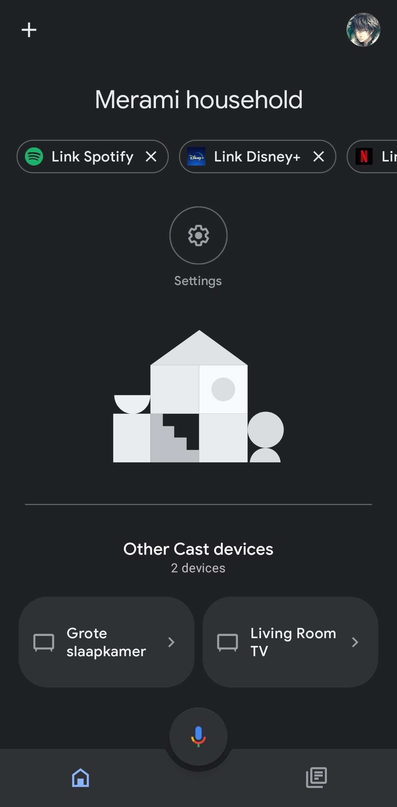
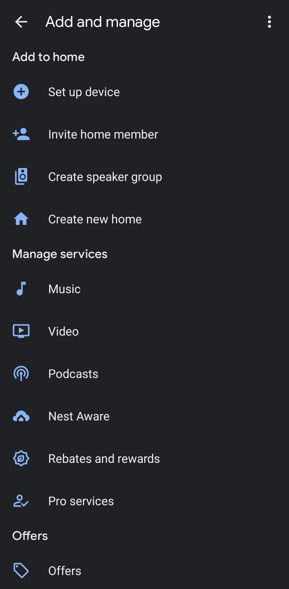
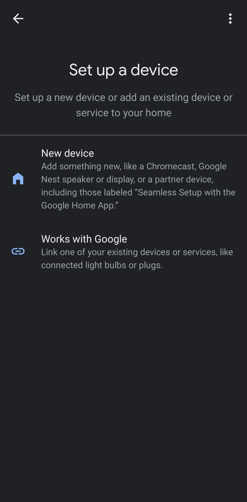
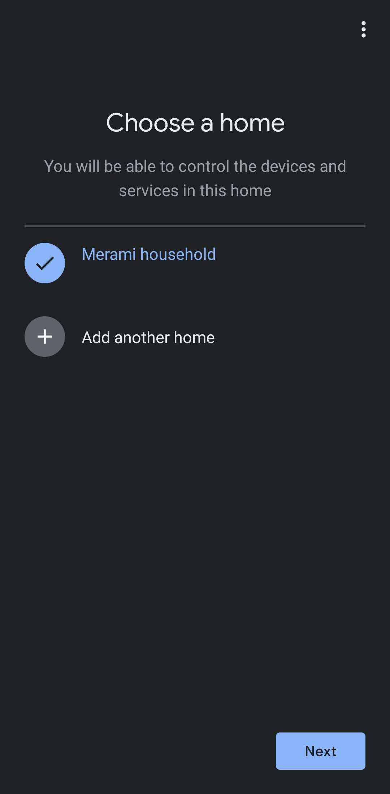
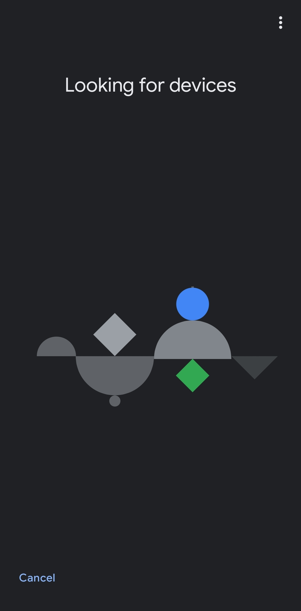

# Internet of Things Smart Oven
This is a manual for the Smart Oven. This oven is a IoT product and this manual is about connecting this oven to your device or Google Home. The errors wil be shown in this manual as far as i could find them.

*Last updated 27-10-2022 01:35*
*By Raekwon Gerold*

## Inhoudsopgave
1. Required parts list
2. Connecting your Oven to google home
3. Connecting your oven to the app for the first time
4. Voice Commands start up & Voice command list
5. How the night mode works
6. Telegram connection test

## Required parts list.
- Arduino
- Arduino IDE
- Ledstrip
- Telegram

## Connecting your Oven to google home
<details open>

- During installation of your oven connect it to the wi-fi and turn it on Bluetooth.
- With the google home app, press the + sign


- Set up device


- New Device


- Select your household


- It will automatically search for it


 - if it fails:
  - you can manually add it (possible through display)


</details>

## Connecting your oven to the app for the first time
<details open>

- Open the app
- Connect to the nearest oven device


- the device should be linked now
  - If it fails:
  - Check if the oven is on and properly connected
  - Try again.
</details>

## Voice Commands start up & Voice command list
<details open>

By integrating the use of voice, U can operate your oven vocally throughout the house, if the oven can hear you.
- The Oven has a pre-fix you can attach to your oven by saying
```
Oven put your pre-fix to x
```
- Using this pre-fix you can now use that name for your oven if you want, it's not an necessity.
- You can have the following voice commands (x for your pre-fix)
  - Oven/x Preheat oven at 85 degrees
  - Oven/x start timer for x minutes (and x seconds)
  - Oven/x Pause timer
  - Oven/x Stop timer
  - Oven/x Turn on nightmode
  - Oven/x Turn off nightmode
  - Oven/x Turn on autosleep
</details>

## How the night mode works
<details open>

Night mode is the state of the oven where it won't make a loud beeping noise when done and will notify the owner through the app with notifications.
- Through your internet or the World Time API, the oven will detect the time.
- Based on the time it will turn on nightmode around 8 PM.
- You can adjust this time through the settings of the app.

It should be working through code like this. according to [WorldTime API](http://worldtimeapi.org/pages/examples)
```
# curl "http://worldtimeapi.org/api/timezone/Europe/Amsterdam"
{
  "abbreviation": "CEST",
  "client_ip": "2a02:a44e:7d3b:1:e521:4b37:4b14:60f5",
  "datetime": "2022-10-26T21:48:46.483337+02:00",
  "day_of_week": 3,
  "day_of_year": 299,
  "dst": true,
  "dst_from": "2022-03-27T01:00:00+00:00",
  "dst_offset": 3600,
  "dst_until": "2022-10-30T01:00:00+00:00",
  "raw_offset": 3600,
  "timezone": "Europe/Amsterdam",
  "unixtime": 1666813726,
  "utc_datetime": "2022-10-26T19:48:46.483337+00:00",
  "utc_offset": "+02:00",
  "week_number": 43
}
```
</details>

## Telegram connection test
<details open>

### Installing the libraries
- Open the libraries tab and download the following:
    - Install UniversalTelegramBot Version 1.3.0 by Brian Lough
    - Install ArduinoJson Version 6.19.4 by Benoit Blanchon

### Installing Telegram and creating a bot
- Open Telegram and make a Telegram account
- Search for the BotFather


- Follow the setup for a new bot


- Keep the bot name, username and bot token
- Copy this code into Arduino:
```
#include <ESP8266WiFi.h>
#include <WiFiClientSecure.h>
#include <TelegramBot.h>

#define LED 15
#define DATA_PIN D5

const char* ssid = "wifi_username";
const char* password = "wifi_password";

const char BotToken[] = "bot_token";

WiFiClientSecure net_ssl;
TelegramBot bot (BotToken, net_ssl);

void setup()
{
  Serial.begin(115200);
  while (!Serial) {} //Start running when the serial is open
  delay(3000);
  Serial.print("Connecting WiFi.");
  Serial.println(ssid);
  while (WiFi.begin(ssid, password) != WL_CONNECTED)
  {
    Serial.print(".");
    delay(500);
  }
  Serial.println("");
  Serial.println("WiFi connected");
  bot.begin();
  pinMode(LED, OUTPUT);
}
void loop() 
{  
  message m = bot.getUpdates(); // Read new messages  
  if (m.text.equals("on")) 
  {  
    digitalWrite(LED, 1);   
    bot.sendMessage(m.chat_id, "LED is ON");
  }  
  else if (m.text.equals("off")) 
  {  
    digitalWrite(LED, 0);   
    bot.sendMessage(m.chat_id, "LED is OFF");  
  } 
}
```
- Fill in wifi_username/wifi_pass and bot_token
- Make sure your Arduino is connected 


- Verify the code


- Got an exit status 1 error.


- Uninstall ArduinoJSon 6.19.4
- Install ArduinoJson version 6.15.2


- Try the code again
- Get another exit status 1 error


- Uninstall ArduinoJson 6.15.2
- Install ArduinoJson 6.13.0


- Try the code again
- Get Another exit status 1 error.


Maybe it's a compatibility issue?
</details>
 
## Sources
1. [WorldTime API](http://worldtimeapi.org/pages/examples)
2. [Google Home API](https://developers.home.google.com/)
3. [Telegram bot arduino guide](https://randomnerdtutorials.com/telegram-control-esp32-esp8266-nodemcu-outputs/)
4. [Adafruit IO Source Quickguide](https://docs.google.com/document/d/13Dvwrig2d11fmS7UafYM0o4nzgMpfTHDadrS2Py0mg0/edit)
