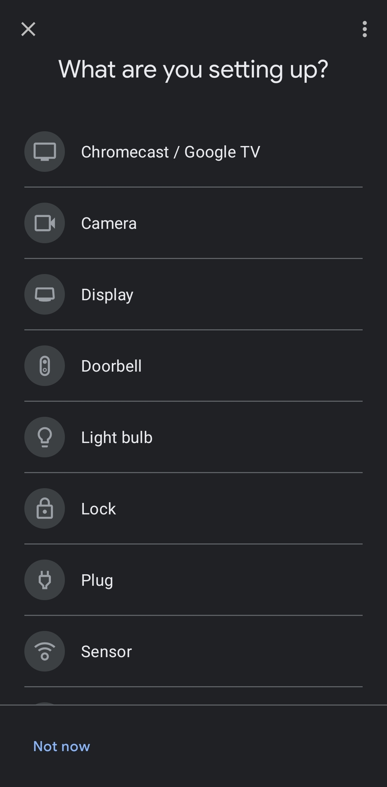

# Internet of Things Smart Oven
Dit is een manual voor de Smart Oven. Deze oven is een IoT product en deze manual gaat over het verbinden van je product tot je device of Google Home. De fouten worden in deze manual genoemt zo ver ik ze heb kunnen ontdekken.

## Connecting your Oven to google home
<details open>

- During installation of your oven connect it to the wi-fi and turn it on Bluetooth.
- With the google home app, press the + sign


- Set up device


- New Device


- Select your household


- It will automatically search for it


 - if it fails:
  - you can manually add it (possible through display)


</details>

## Connecting oven to the app for the first time
<details open>

- Open the app
- Connect to the nearest oven device


- the device should be linked now
  - If it fails:
  - Check if the oven is on and properly connected
  - Try again.
</details>

## Using the app/screen
<details open>

- Open the app
- choose the option you wanna go for ex. pre-heat
- select the option.
- get the confirmation
- it should be working
  - If it fails:
  - If you got the confirmation but it didn't pre-heat, manually pre-heat the oven and try to reconnect your device to the oven
  - No connection to the oven, either the oven is turned off or there's something wrong with your connection at home.(check with your provider if the router isn't being updated)
</details>

## Voice Commands
<details open>

- The Oven has a pre-fix you can attach to your oven by saying
```
Oven put your pre-fix to x
```
- Using this pre-fix you can now use that name for your oven if you want, it's not an necessity.
- You can have the following voice commands (x for your pre-fix)
  - Oven/x Preheat oven at 85 degrees
  - Oven/x start timer for x minutes (and x seconds)
  - Oven/x Pause timer
  - Oven/x Stop timer
  - Oven/x Turn on nightmode
  - Oven/x Turn off nightmode
  - Oven/x Turn on autosleep
</details>

## How the night mode works
<details open>

- Through your internet or the World Time API, the oven will detect the time.
- Based on the time it will turn on nightmode around 8 PM.
- You can adjust this time through the settings of the app.

It should be working through code like this.
```
# curl "http://worldtimeapi.org/api/timezone/Europe/Amsterdam"
{
  "abbreviation": "CEST",
  "client_ip": "2a02:a44e:7d3b:1:e521:4b37:4b14:60f5",
  "datetime": "2022-10-26T21:48:46.483337+02:00",
  "day_of_week": 3,
  "day_of_year": 299,
  "dst": true,
  "dst_from": "2022-03-27T01:00:00+00:00",
  "dst_offset": 3600,
  "dst_until": "2022-10-30T01:00:00+00:00",
  "raw_offset": 3600,
  "timezone": "Europe/Amsterdam",
  "unixtime": 1666813726,
  "utc_datetime": "2022-10-26T19:48:46.483337+00:00",
  "utc_offset": "+02:00",
  "week_number": 43
}
```

- I tried it myself with not much success.
</details>
